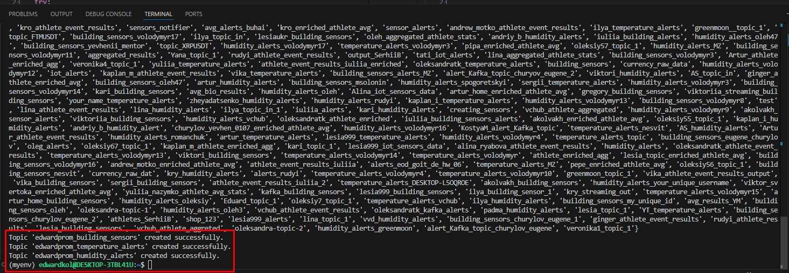
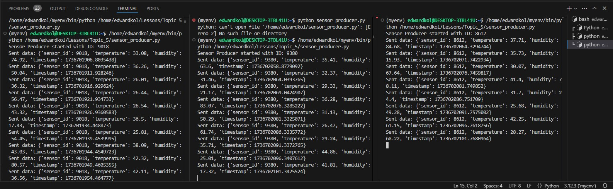
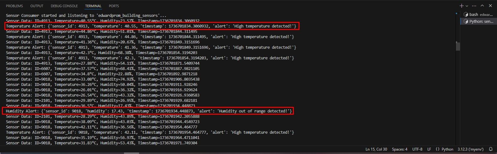
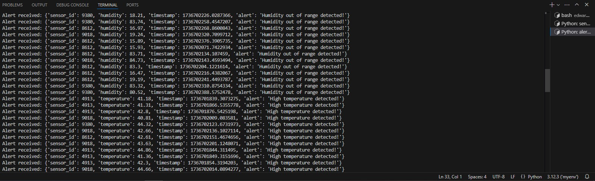

## Крок 1: Створення топіків
- Успішно створено три топіки:
  - `edwardprom_building_sensors`
  - `edwardprom_temperature_alerts`
  - `edwardprom_humidity_alerts`
- Використовувався скрипт `create_topics.py`.
- **Скриншот підтвердження:**  
  

## Крок 2: Генерація даних сенсорів
- Реалізовано продюсер (`sensor_producer.py`), який генерує випадкові значення температури (25-45°C) та вологості (15-85%) з унікальним `sensor_id`.
- Запущено кілька продюсерів одночасно для імітації роботи кількох сенсорів.
- Дані передаються у топік `edwardprom_building_sensors`.
- **Скриншот роботи продюсерів:**  
  

## Крок 3: Обробка даних
- Реалізовано консюмер (`sensor_consumer.py`), який підписується на топік `edwardprom_building_sensors`.
- Логіка:
  - Якщо температура > 40°C — генерується сповіщення і відправляється в топік `edwardprom_temperature_alerts`.
  - Якщо вологість < 20% або > 80% — генерується сповіщення і відправляється в топік `edwardprom_humidity_alerts`.
- У терміналі відображаються всі отримані дані сенсорів та згенеровані алерти.
- **Скриншот обробки та фільтрації даних:**  
  

## Крок 4: Виведення остаточних даних
- Реалізовано консюмер (`alert_consumer.py`), який підписується на топіки `edwardprom_temperature_alerts` та `edwardprom_humidity_alerts`.
- Консюмер виводить отримані сповіщення (алерти) у термінал.
- **Скриншот виведених алертів:**  
  
